# Lab: Defesa em Profundidade no Cisco Packet Tracer

> Laboratório prático do curso **Cisco Networking Academy: Defesa de Rede (Network Defense)**, Módulo 1: Entendendo a Defesa.
> Autor: **João Victor Paixão Zolim**

Simulação de uma pequena empresa com rede de funcionários, rede de visitantes e servidor interno. O objetivo é impedir que visitantes alcancem o servidor, aplicando **defesa em profundidade**: vários controles empilhados, para que a falha de um não comprometa o ambiente.

| Camada | Controle | Status |
|---|---|---|
| 1. Segmentação | VLANs no switch | ✅ Concluída |
| 2. Filtro de tráfego | ACL estendida no roteador | ✅ Concluída |
| 3. Controle de porta | Port security no switch | ⏳ Em andamento |
| 4. Simulação de ataque | Dispositivo intruso na rede | ⏳ Próxima etapa |

---

## Sumário

1. [Topologia](#1-topologia)
2. [Endereçamento](#2-endereçamento)
3. [Etapa 1: Montagem física](#3-etapa-1-montagem-física)
4. [Etapa 2: VLANs (segmentação)](#4-etapa-2-vlans-segmentação)
5. [Etapa 3: Roteamento entre VLANs](#5-etapa-3-roteamento-entre-vlans-router-on-a-stick)
6. [Etapa 4: ACL (filtro de tráfego)](#6-etapa-4-acl-estendida-filtro-de-tráfego)
7. [Problemas encontrados](#7-problemas-encontrados-e-soluções)
8. [Lições aprendidas](#8-lições-aprendidas)
9. [Próximos passos](#9-próximos-passos)

---

## 1. Topologia

```
                 [R1 - Cisco 2911]
                        | G0/0  (subinterfaces .10 e .20)
                        |
                        | G0/1  (trunk 802.1Q)
                 [SW1 - Cisco 2960]
        Fa0/1 /    Fa0/2 |    Fa0/3 \       Fa0/10
         [PC-ADM1]  [PC-ADM2]  [SRV-INTERNO]  [PC-VISITANTE]
         \________ VLAN 10 - ADM ________/    VLAN 20 - VISITANTES
```

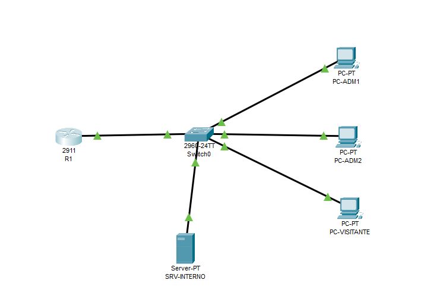

| Equipamento | Modelo | Função |
|---|---|---|
| R1 | Cisco 2911 | Roteamento entre VLANs e filtragem (ACL) |
| SW1 | Cisco 2960-24TT | Segmentação (VLANs) e controle de portas |
| PC-ADM1, PC-ADM2 | PC-PT | Estações dos funcionários |
| SRV-INTERNO | Server-PT | Servidor interno da empresa (ativo a proteger) |
| PC-VISITANTE | PC-PT | Estação da rede de visitantes (não confiável) |

---

## 2. Endereçamento

| Dispositivo | Interface | VLAN | IP | Gateway |
|---|---|---|---|---|
| R1 | G0/0.10 | 10 | 192.168.10.1/24 | — |
| R1 | G0/0.20 | 20 | 192.168.20.1/24 | — |
| PC-ADM1 | Fa0 | 10 | 192.168.10.11/24 | 192.168.10.1 |
| PC-ADM2 | Fa0 | 10 | 192.168.10.12/24 | 192.168.10.1 |
| SRV-INTERNO | Fa0 | 10 | 192.168.10.100/24 | 192.168.10.1 |
| PC-VISITANTE | Fa0 | 20 | 192.168.20.11/24 | 192.168.20.1 |

### Portas do switch

| Porta SW1 | Dispositivo | Modo | VLAN |
|---|---|---|---|
| Fa0/1 | PC-ADM1 | access | 10 |
| Fa0/2 | PC-ADM2 | access | 10 |
| Fa0/3 | SRV-INTERNO | access | 10 |
| Fa0/10 | PC-VISITANTE | access | 20 |
| Gi0/1 | R1 (G0/0) | trunk | 10, 20 |

---

## 3. Etapa 1: Montagem física

Todos os dispositivos foram ligados ao switch com cabos **Copper Straight-Through**, e o switch ao roteador.

Na primeira montagem o switch ficou de fora e os PCs foram ligados direto no roteador (ver [Problema 1](#problema-1-topologia-sem-switch)). Depois da correção:

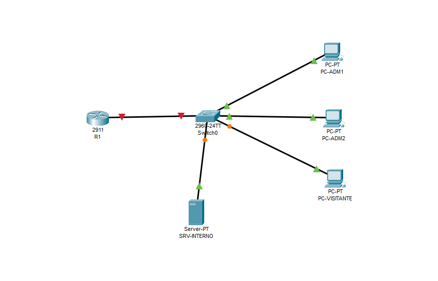

O link entre R1 e SW1 ficou **vermelho**. Era o esperado: as interfaces de roteadores Cisco vêm em `shutdown` por padrão, um exemplo de **secure by default**. Como o roteador costuma ligar redes diferentes (inclusive a internet), nada é exposto até que alguém habilite a interface conscientemente.

---

## 4. Etapa 2: VLANs (segmentação)

**Objetivo:** separar funcionários e visitantes em domínios de broadcast diferentes.

```
enable
configure terminal
hostname SW1

vlan 10
 name ADM
vlan 20
 name VISITANTES
exit

interface range fastEthernet0/1 - 3
 switchport mode access
 switchport access vlan 10
exit

interface fastEthernet0/10
 switchport mode access
 switchport access vlan 20
exit

interface gigabitEthernet0/1
 switchport mode trunk
exit

end
write memory
```

| Comando | Função |
|---|---|
| `switchport mode access` | Porta de dispositivo final, pertence a uma única VLAN. Também impede a negociação automática de trunk, mitigando **VLAN hopping** |
| `switchport access vlan X` | Associa a porta à VLAN |
| `switchport mode trunk` | Porta que transporta várias VLANs (marcação 802.1Q) até o roteador |

**Verificação:** `show vlan brief`

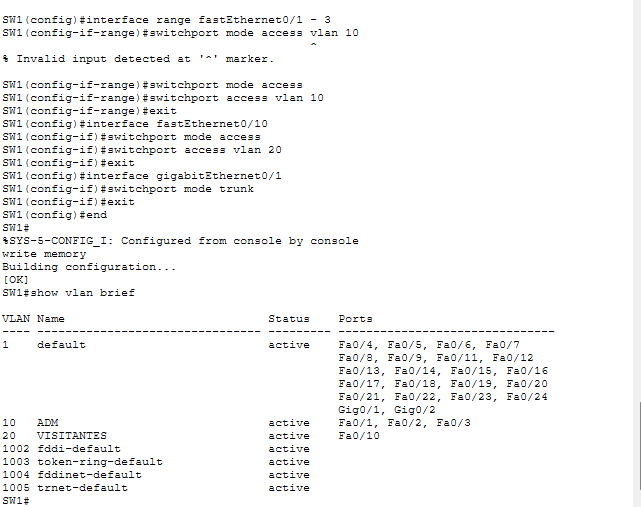

Fa0/1-3 na VLAN 10 e Fa0/10 na VLAN 20. ✅

> A Gi0/1 ainda aparecia na VLAN 1 porque, com o lado do roteador desligado, o trunk não estava operacional. Portas em trunk ativo não são listadas no `show vlan brief`.

---

## 5. Etapa 3: Roteamento entre VLANs (router-on-a-stick)

**Objetivo:** uma única interface física do roteador, dividida em subinterfaces, faz o gateway de cada VLAN.

```
enable
configure terminal
hostname R1

interface gigabitEthernet0/0
 no shutdown
exit

interface gigabitEthernet0/0.10
 encapsulation dot1Q 10
 ip address 192.168.10.1 255.255.255.0
exit

interface gigabitEthernet0/0.20
 encapsulation dot1Q 20
 ip address 192.168.20.1 255.255.255.0
exit

end
write memory
```

**Verificação:** `show ip interface brief`

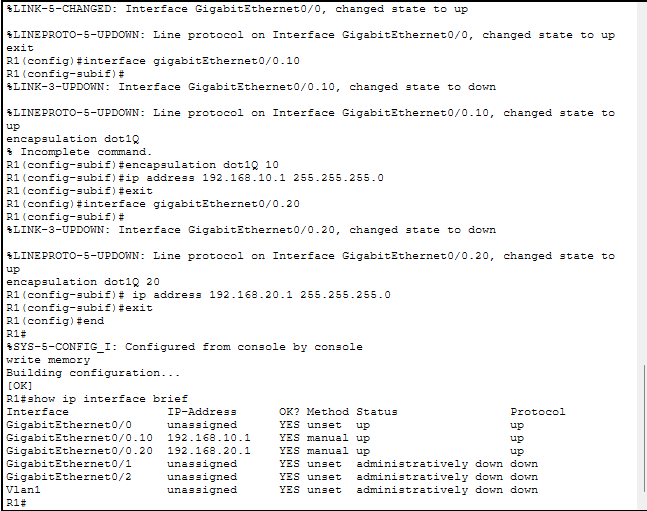

As subinterfaces `.10` e `.20` estão **up/up**. G0/1 e G0/2 continuam `administratively down`: sem uso, então permanecem desligadas.

### IPs dos hosts

Configurados em **Desktop → IP Configuration → Static**:

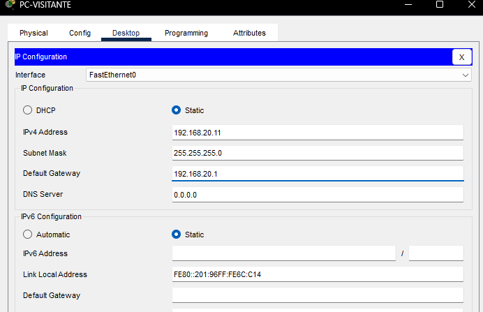

### Teste: a falha de segurança aparece

Do **PC-VISITANTE**:

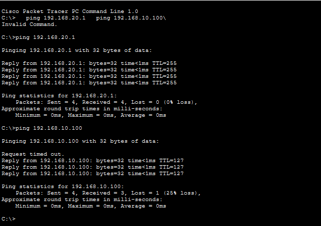

O visitante **alcançou o servidor interno**. 

**Por quê:** a VLAN separa, mas o roteador reconecta. Assim que o roteamento entre VLANs foi configurado, o R1 passou a encaminhar tudo entre as redes, sem nenhum critério. **Segmentação sozinha não é suficiente**, e é aí que entra a próxima camada.

**Análise do TTL:**

| Ping | TTL | Interpretação |
|---|---|---|
| Visitante → gateway 192.168.20.1 | 255 | Resposta do próprio roteador (IOS começa em 255) |
| Visitante → servidor 192.168.10.100 | 127 | Servidor começa em 128 e o pacote passou por **1 roteador** |
| ADM1 → servidor | 128 | Mesma VLAN: o switch entrega direto, **sem passar pelo roteador** |

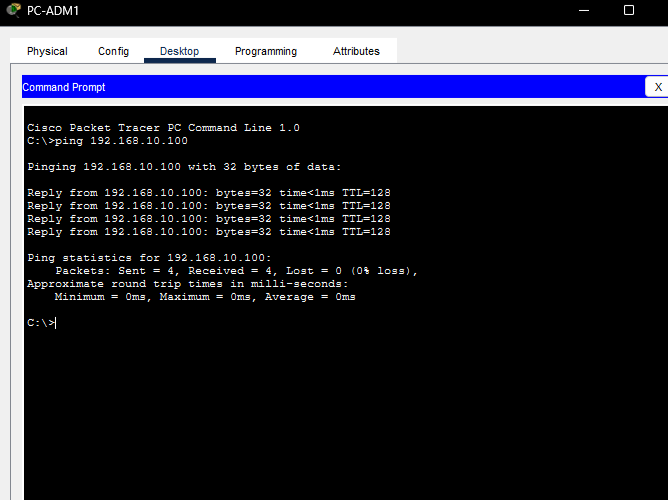

---

## 6. Etapa 4: ACL estendida (filtro de tráfego)

**Regra de negócio:** visitantes não podem acessar nada da rede ADM (192.168.10.0/24). O resto continua liberado.

```
configure terminal
no ip domain-lookup

ip access-list extended BLOQUEIA-VISITANTES
 remark Visitantes nao acessam a rede ADM
 deny ip 192.168.20.0 0.0.0.255 192.168.10.0 0.0.0.255
 permit ip any any
exit

interface gigabitEthernet0/0.20
 ip access-group BLOQUEIA-VISITANTES in
exit

end
write memory
```

| Elemento | Explicação |
|---|---|
| `extended` | Filtra por origem **e** destino (e por protocolo/porta, se necessário) |
| `0.0.0.255` | **Wildcard mask**: `0` = o bit precisa bater, `255` = qualquer valor |
| `permit ip any any` | Obrigatório: toda ACL termina com um **deny any implícito** |
| `in` na G0/0.20 | ACL estendida fica **o mais perto possível da origem** do tráfego |

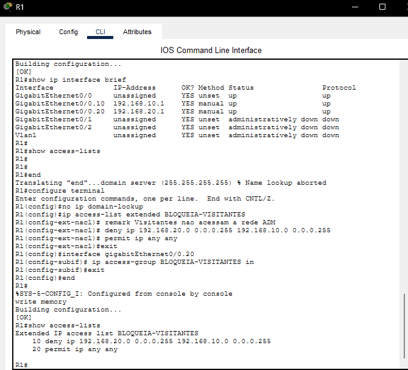

### Teste: bloqueio confirmado

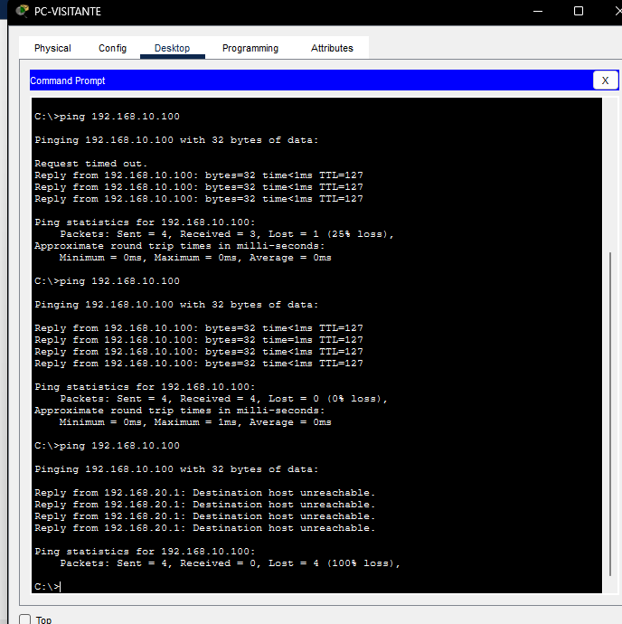

| Momento | Resultado |
|---|---|
| Antes da ACL | `Reply from 192.168.10.100 ... TTL=127` |
| Depois da ACL | `Reply from 192.168.20.1: Destination host unreachable` |

Depois da ACL, quem responde é o **roteador**, avisando que recusou o pacote.

### Evidência: contadores da ACL

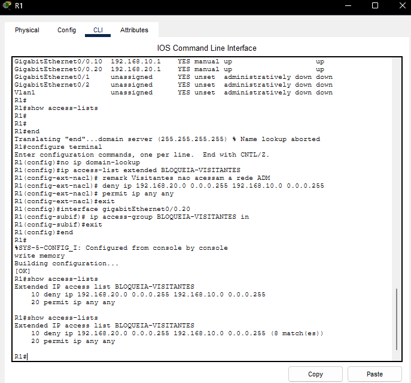

A linha `deny` registrou **8 matches**. Abaixo, de onde vêm eles.

### Efeito colateral: ADM1 também não alcança o visitante

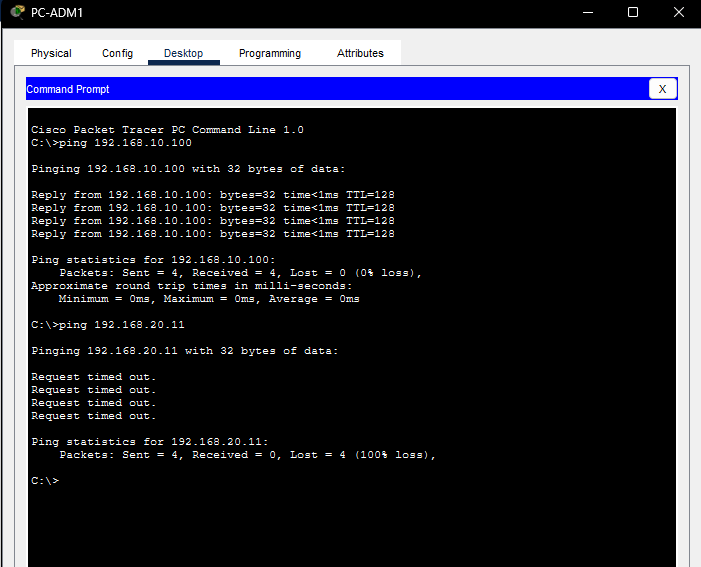

```
IDA   (echo request)  ADM1 → visitante   10.x → 20.x   ✅ sai pela G0/0.20 (não filtrada)
VOLTA (echo reply)    visitante → ADM1   20.x → 10.x   ❌ entra pela G0/0.20 e casa com o deny
```

- **8 matches** = 4 pacotes do ping visitante → servidor + 4 respostas do visitante → ADM1.
- O visitante recebeu `Destination host unreachable` porque o roteador avisa a **origem** do pacote bloqueado.
- O ADM1 recebeu `Request timed out` porque a resposta simplesmente nunca chegou.

**Conclusão:** ACLs são **stateless**. Elas avaliam cada pacote isoladamente e não sabem que foi a ADM1 que iniciou a conversa. Para permitir "ADM inicia, visitante apenas responde", é preciso um **firewall stateful** (tema dos módulos de Tecnologias de Firewall e Zone-Based Policy Firewall).

---

## 7. Problemas encontrados e soluções

### Problema 1: Topologia sem switch

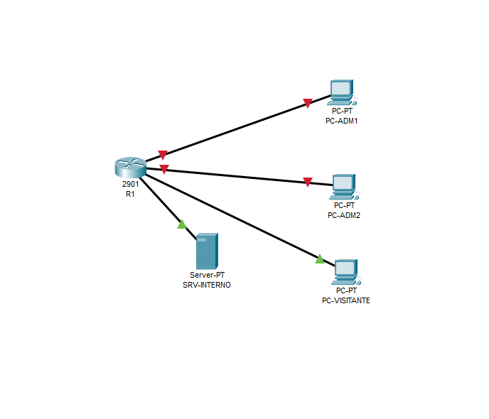

| | |
|---|---|
| **Sintoma** | PCs e servidor ligados direto no roteador, links com estados misturados |
| **Causa** | O switch não foi adicionado à topologia |
| **Impacto** | Sem switch não há VLANs nem port security, ou seja, duas das três camadas do lab |
| **Solução** | Remover os cabos, adicionar um 2960 e religar tudo nas portas planejadas |

### Problema 2: Comandos juntos na mesma linha

| | |
|---|---|
| **Sintoma** | `% Invalid input detected at '^' marker.` (switch) e `Invalid Command.` (PC) |
| **Causa** | `switchport mode access vlan 10` misturou dois comandos; no PC, dois `ping` foram colados numa linha só |
| **Solução** | Um comando por linha. O `^` indica exatamente onde o IOS parou de entender |

### Problema 3: Comando incompleto

| | |
|---|---|
| **Sintoma** | `% Incomplete command.` |
| **Causa** | `encapsulation dot1Q` sem o número da VLAN |
| **Solução** | `encapsulation dot1Q 10` |

### Problema 4: Assistente de configuração inicial no roteador

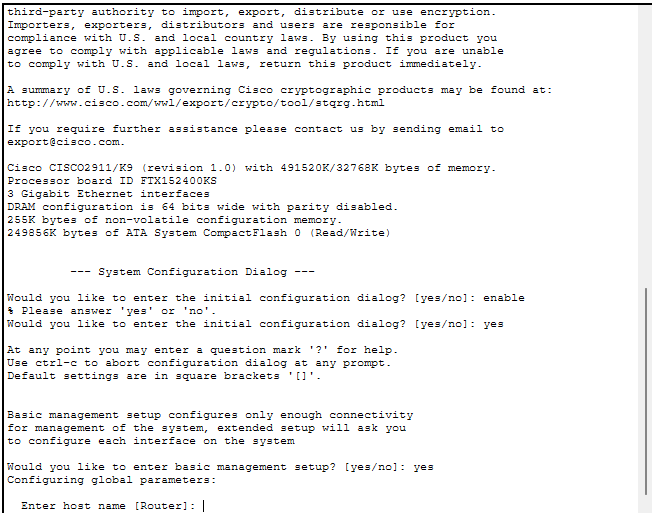

| | |
|---|---|
| **Sintoma** | O R1 abriu o *System Configuration Dialog* e passou a pedir hostname, senhas etc. |
| **Causa** | Roteador sem configuração salva na NVRAM + resposta `yes` ao assistente |
| **Solução** | `Ctrl + C` para abortar, ou responder `no`. Depois do `write memory` o assistente não aparece mais |

### Problema 5: ACL sem efeito

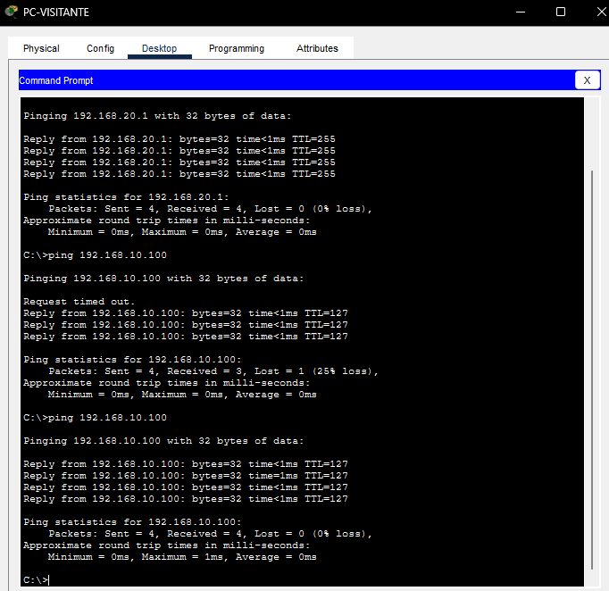

| | |
|---|---|
| **Sintoma** | Visitante continuava alcançando o servidor |
| **Hipóteses** | (1) ACL não criada; (2) criada mas não aplicada; (3) aplicada na interface ou direção errada |
| **Diagnóstico** | `show access-lists` voltou **vazio** → hipótese 1 confirmada |
| **Causa** | A etapa de criação da ACL foi pulada |
| **Solução** | Criar e aplicar a ACL, e verificar com `show access-lists` |

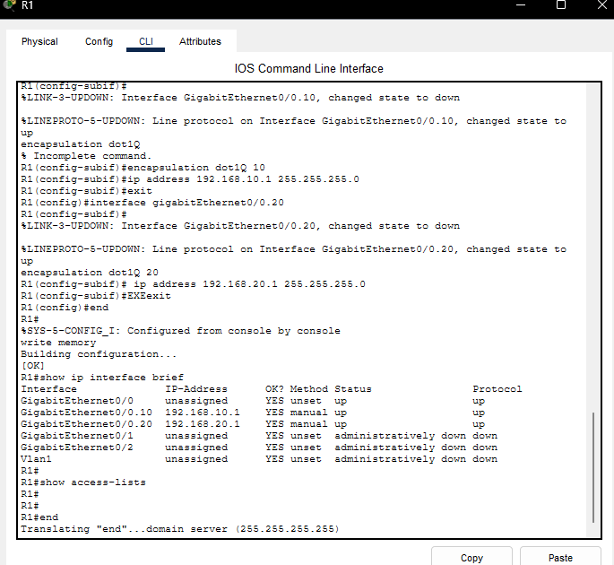

### Problema 6: Travamento com "Translating ... domain server"

| | |
|---|---|
| **Sintoma** | `Translating "end"...domain server (255.255.255.255)` e a CLI travando por alguns segundos |
| **Causa** | `end` digitado no modo privilegiado (`R1#`), onde não é um comando válido. O IOS interpreta palavras desconhecidas como nome de host e tenta resolver via DNS |
| **Solução** | `Ctrl + Shift + 6` para abortar e `no ip domain-lookup` para desativar de vez |

---

## 8. Lições aprendidas

1. **Secure by default:** interfaces de roteador vêm desligadas, e portas sem uso devem continuar assim.
2. **VLAN não é firewall:** a segmentação é anulada assim que existe roteamento entre as VLANs sem filtro.
3. **ACL estendida perto da origem**, e nunca esquecer o `deny any` implícito.
4. **ACLs são stateless:** bloquear um sentido também bloqueia as respostas desse sentido.
5. **TTL é informação:** dá para inferir quantos saltos o pacote percorreu e até o sistema operacional de origem.
6. **Troubleshooting por hipóteses:** listar as causas possíveis e eliminá-las com comandos `show`, em vez de reconfigurar tudo às cegas.
7. **Contadores de ACL são evidência:** os `matches` provam que a regra está atuando, o que é útil para auditoria e resposta a incidentes.

---

## 9. Próximos passos

- [ ] **Port security** nas portas de acesso (`maximum 1`, `mac-address sticky`, `violation shutdown`)
- [ ] Desligar as portas sem uso do switch
- [ ] **Simulação de ataque:** conectar um dispositivo intruso no lugar do PC-VISITANTE e observar a porta entrar em *err-disabled*
- [ ] Endurecer o acesso aos equipamentos: senhas, `service password-encryption`, SSH no lugar de Telnet
- [ ] Refazer a política de visitantes com **firewall stateful / ZBF** quando chegar aos módulos de firewall

---

*Lab desenvolvido durante os estudos do curso Defesa de Rede (Cisco Networking Academy).*
