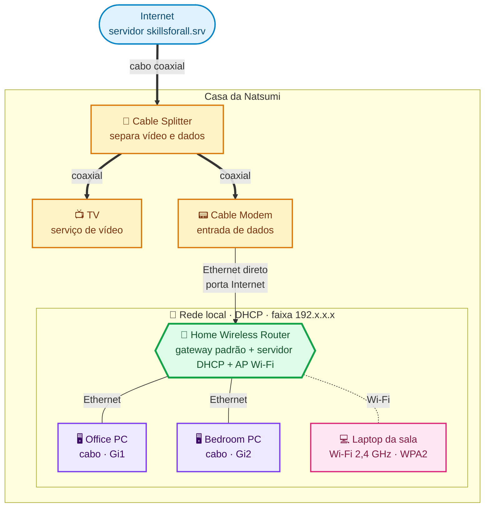
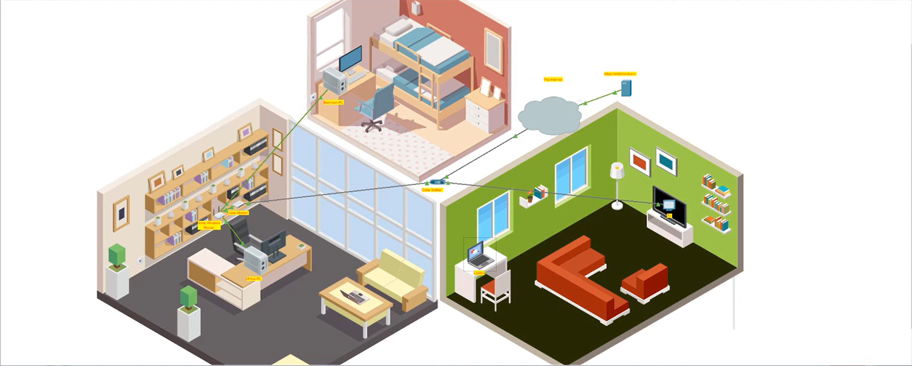
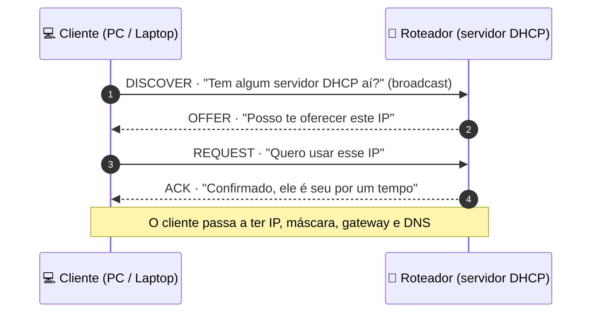
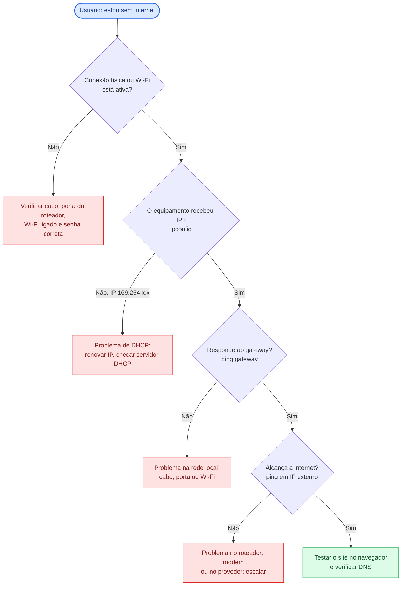

<div align="center">

# Home Lab: Rede Doméstica com Roteador Wi-Fi

**Cabeamento, roteador sem fio, DHCP, Wi-Fi com WPA2 e testes de conectividade**


</div>

---

## Sobre o lab

Laboratório prático do curso **Conceitos Básicos de Redes** (Cisco Networking Academy), feito no **Cisco Packet Tracer**.

**Cenário:** montar do zero a rede de uma casa nova. Isso inclui conectar os cabos ao serviço de TV a cabo e à internet, configurar o roteador sem fio, ativar uma rede Wi-Fi protegida e validar que todos os dispositivos chegam à internet.

>"o computador não tem internet", "o Wi-Fi não conecta", "o equipamento não pega IP".

---

## 🗺️ Topologia lógica



### Visão no simulador



---

## Dispositivos e conexões

| # | Origem | Porta | Destino | Porta | Cabo |
|---|--------|-------|---------|-------|------|
| 1 | Cable Splitter | Coaxial1 | Cable Modem | Port 0 | Coaxial |
| 2 | Cable Splitter | Coaxial2 | TV | Port 0 | Coaxial |
| 3 | Cable Modem | Port 1 | Home Wireless Router | Internet | Ethernet direto (straight-through) |
| 4 | Office PC | FastEthernet0 | Home Wireless Router | GigabitEthernet 1 | Ethernet direto |
| 5 | Bedroom PC | FastEthernet0 | Home Wireless Router | GigabitEthernet 2 | Ethernet direto |
| 6 | Laptop (sala) | Placa Wi-Fi | Home Wireless Router | Rede sem fio | Wi-Fi 2,4 GHz |

---

## Passo a passo resumido

### Parte 1 · Conectar os dispositivos 🔧
1. Ligar o serviço de TV a cabo ao **splitter**, que divide o sinal em dois caminhos: vídeo para a TV e dados para o modem.
2. Conectar o **cable modem** à porta *Internet* do roteador.
3. Ligar os dois PCs às portas Ethernet do roteador.
4. Teste: a TV exibe imagem ao ser ligada, o que confirma que o cabeamento coaxial está correto.

### Parte 2 · Configurar o roteador 🛠️
1. No Office PC, obter IP por **DHCP** e anotar o **gateway padrão**, que é o endereço do roteador.
2. Acessar a interface web do roteador pelo navegador, usando o endereço do gateway.
3. **Limitar o DHCP a 10 usuários**, porque a casa terá poucos dispositivos.
4. **Trocar a senha padrão de administrador** na aba *Administration*.
5. Ativar a rede **2,4 GHz**, renomear o **SSID** e proteger com **WPA2 Personal**.

### Parte 3 · Testar a conectividade ✅
1. Conectar o laptop ao Wi-Fi e conferir se ele recebeu IP.
2. Abrir `skillsforall.srv` no navegador do Office PC, do Bedroom PC e do laptop.
3. Se as três páginas carregarem, a rede com fio, o Wi-Fi, o DHCP e a saída para a internet estão funcionando.

---

## Como o DHCP entrega o IP (DORA)



---

## Boas práticas de segurança aplicadas

| Prática | Por que importa |
|---|---|
| Trocar a senha padrão do roteador | Credenciais de fábrica são conhecidas e testadas por atacantes |
| Usar **WPA2 Personal** no Wi-Fi | Sem criptografia, qualquer pessoa por perto entra na rede |
| Escolher uma senha de Wi-Fi forte | A frase de acesso é a primeira barreira da rede sem fio |
| Limitar o pool de DHCP | Reduz o número de endereços disponíveis para dispositivos não previstos |

> **Nota:** as senhas usadas no exercício são valores de laboratório e foram omitidas aqui de propósito. Em ambiente real, use senhas únicas e nunca as publique em repositórios.

---

## Roteiro de diagnóstico (visão de suporte N1)

Quando o usuário disser **"estou sem internet"**, este é o raciocínio que o lab me ajudou a organizar:



### Comandos úteis para validar

```bash
ipconfig /all        # IP, máscara, gateway e servidor DHCP/DNS do equipamento
ipconfig /renew      # pede um novo IP ao servidor DHCP
ping <gateway>       # testa a comunicação com o roteador
ping <IP externo>    # testa a saída para fora da rede local
```

---


## Ferramentas

`Cisco Packet Tracer` · `Ethernet` · `Cabo coaxial` · `Wi-Fi 2,4 GHz` · `WPA2` · `DHCP` · `IPv4`

---

## Autor

**João Victor Paixão Zolim**
 [LinkedIn](https://www.linkedin.com/in/joao-victor-paixao-zolim) · [GitHub](https://github.com/joaovpzdev)

> Laboratório realizado para fins educacionais, no curso Conceitos Básicos de Redes da Cisco Networking Academy.
