# Lab 1: Montagem da Topologia e Acesso Seguro aos Dispositivos

> Laboratório prático baseado no curso **Cisco Networking Academy: Network Defense**.
> Autor: **João Victor Paixão Zolim**
> Ferramenta: Cisco Packet Tracer

Primeiro de uma série de 7 labs que constroem, passo a passo, a rede de uma pequena empresa protegida com **defesa em profundidade**. Neste lab, a rede é montada e o acesso de gerenciamento aos roteadores e switches é protegido.

**Resultado:** Telnet é recusado, SSH versão 2 funciona com usuário e senha, e todas as senhas ficam protegidas na configuração.

| Item | Status |
| --- | --- |
| Montagem e cabeamento da topologia | ✅ Concluído |
| Segurança básica (senhas, banner, console) em R1, ISP, S1 e S2 | ✅ Concluído |
| SSH versão 2 em R1, S1 e S2 | ✅ Concluído |
| Proteção contra força bruta em R1 (`login block-for`) | ✅ Concluído |
| Rota padrão de R1 para o ISP | ✅ Concluído (adiantado do Lab 2) |
| Teste de SSH em S1 e S2 | ⏳ Lab 2 (os switches ainda não têm IP) |

---

## Sumário

1. [Objetivo](#1-objetivo)
2. [Topologia](#2-topologia)
3. [Endereçamento usado neste lab](#3-endereçamento-usado-neste-lab)
4. [Como funciona](#4-como-funciona)
5. [Configuração passo a passo](#5-configuração-passo-a-passo)
6. [Verificação](#6-verificação)
7. [Problemas encontrados e soluções](#7-problemas-encontrados-e-soluções)
8. [Limitações](#8-limitações)
9. [Lições aprendidas](#9-lições-aprendidas)
10. [Próximo passo](#10-próximo-passo)

---

## 1. Objetivo

Garantir que **só administradores autorizados** consigam gerenciar os equipamentos de rede, e que essa comunicação seja **criptografada**.

Isso corresponde à primeira camada da defesa em profundidade: se um atacante entra na rede, ele não deve conseguir assumir o controle de um roteador ou switch.

---

## 2. Topologia

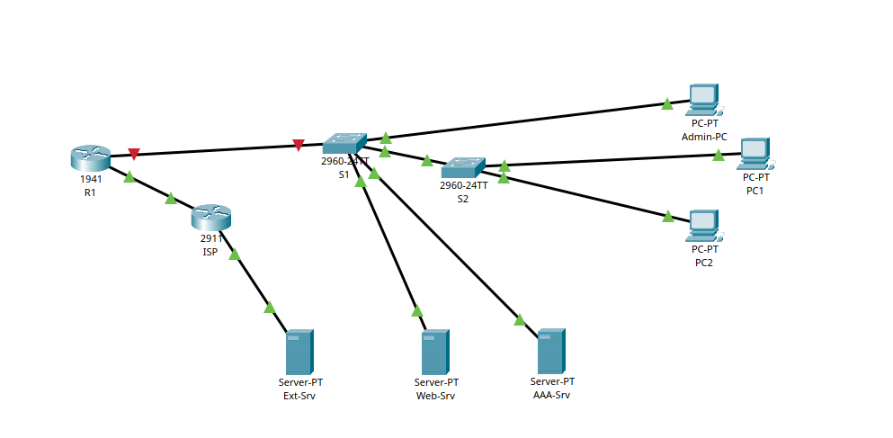

```text
                 [Ext-Srv] 198.51.100.10
                     |
                   G0/1
                  [ISP] (2911)        ← simula a internet
                   G0/0
                     |
                   G0/0
                  [R1] (1941)         ← roteador de borda da matriz
                   G0/1
                     |
                   G0/1
  [Admin-PC]──Fa0/5 [S1] (2960) Fa0/10──[Web-Srv]
                     |  Fa0/11──[AAA-Srv]
                   G0/2
                     |
                   G0/1
                  [S2] (2960)
             Fa0/1 /    \ Fa0/2
             [PC1]       [PC2]
```

O enlace **R1 ↔ S1 aparece vermelho** na imagem porque a interface G0/1 de R1 ainda está desligada. Ela será configurada no Lab 2, com as subinterfaces das VLANs.

| Dispositivo | Modelo | Função |
| --- | --- | --- |
| R1 | ISR 1941 | Roteador de borda da matriz |
| ISP | ISR 2911 | Provedor de internet simulado |
| S1 | 2960-24TT | Switch de distribuição |
| S2 | 2960-24TT | Switch de acesso dos usuários |
| Admin-PC, PC1, PC2 | PC | Estações (configuradas no Lab 2) |
| Web-Srv, AAA-Srv | Server | Servidores internos (configurados nos Labs 2 e 5) |
| Ext-Srv | Server | Servidor web "na internet" |

---

## 3. Endereçamento usado neste lab

| Dispositivo | Interface | Endereço | Gateway |
| --- | --- | --- | --- |
| R1 | G0/0 | 203.0.113.1 /30 | 203.0.113.2 (rota padrão) |
| ISP | G0/0 | 203.0.113.2 /30 | - |
| ISP | G0/1 | 198.51.100.1 /24 | - |
| Ext-Srv | NIC | 198.51.100.10 /24 | 198.51.100.1 |

As faixas `203.0.113.0/24` e `198.51.100.0/24` são reservadas para documentação (RFC 5737), por isso são usadas como "IPs públicos" no lab.

---

## 4. Como funciona

### Modos do IOS

O IOS tem níveis de acesso. Cada comando só funciona no modo certo:

| Prompt | Modo | O que permite |
| --- | --- | --- |
| `R1>` | EXEC usuário | Comandos básicos (`ping`, alguns `show`) |
| `R1#` | EXEC privilegiado | Todos os `show`, salvar, reiniciar |
| `R1(config)#` | Configuração global | Alterar a configuração |

Quem entra pelo console cai no modo usuário. Para chegar ao modo privilegiado, precisa da **enable secret**.

### Camadas de proteção aplicadas

| Controle | Comando | Protege contra |
| --- | --- | --- |
| Senha mínima | `security passwords min-length 10` | Senhas curtas e fáceis de adivinhar |
| Enable secret | `enable secret` | Acesso ao modo privilegiado. A senha fica salva como **hash** (tipo 5, MD5) |
| Criptografia de senhas | `service password-encryption` | Leitura de senhas por quem vê a configuração (tipo 7, proteção fraca e reversível) |
| Banner | `banner motd` | Aviso legal de que o acesso é restrito e monitorado |
| Console | `password` + `login` + `exec-timeout` | Acesso físico sem senha e sessões esquecidas abertas |
| SSH v2 | `ip ssh version 2` + `transport input ssh` | Senhas e comandos trafegando em texto puro (Telnet) |
| Usuário local | `username ... secret` + `login local` | Acesso remoto sem identificação individual |
| Bloqueio de login | `login block-for 120 attempts 3 within 60` | Ataques de força bruta |

### Por que SSH e não Telnet

O **Telnet** envia tudo em texto puro: usuário, senha e comandos. Qualquer pessoa capturando tráfego (com Wireshark, por exemplo) lê tudo. O **SSH** criptografa a sessão inteira, então quem captura o tráfego só vê dados embaralhados.

Para gerar as chaves do SSH, o equipamento precisa de **hostname** e **nome de domínio**. A chave recebe o nome `hostname.domínio` (por exemplo, `R1.netdef.lab`).

### Rota padrão

Um roteador só encaminha pacotes para redes que conhece. R1 conhecia apenas a rede ligada diretamente a ele (`203.0.113.0/30`). A **rota padrão** (`0.0.0.0/0`) manda para o ISP tudo o que R1 não conhece, que é como empresas reais saem para a internet.

---

## 5. Configuração passo a passo


### R1 (roteador de borda)

```text
enable
configure terminal
hostname R1
no ip domain-lookup
security passwords min-length 10
enable secret <senha-enable>
service password-encryption
banner motd #Authorized access only. Activity is monitored.#
line console 0
 password <senha-console>
 login
 exec-timeout 5 0
 logging synchronous
 exit
interface g0/0
 ip address 203.0.113.1 255.255.255.252
 no shutdown
 exit
ip route 0.0.0.0 0.0.0.0 203.0.113.2
ip domain-name netdef.lab
username netadmin privilege 15 secret <senha-admin>
crypto key generate rsa          ! tamanho: 1024
ip ssh version 2
line vty 0 4
 transport input ssh
 login local
 exec-timeout 5 0
 exit
login block-for 120 attempts 3 within 60
end
copy running-config startup-config
```

### ISP

Mesma segurança básica de R1 (sem SSH: na vida real, o roteador do provedor não é nosso). Muda o hostname e as interfaces:

```text
interface g0/0
 ip address 203.0.113.2 255.255.255.252
 no shutdown
interface g0/1
 ip address 198.51.100.1 255.255.255.0
 no shutdown
```

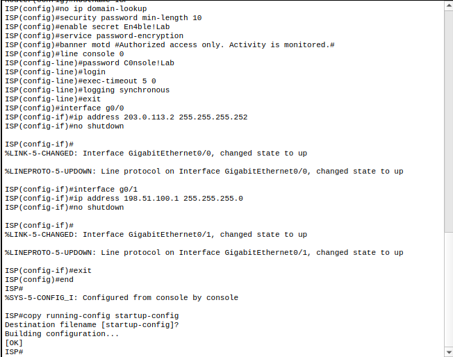

### S1 e S2 (switches)

Mesma segurança básica, com duas diferenças:

- O 2960 **não aceita** `security passwords min-length` (ver [Limitações](#8-limitações)).
- Switches têm **16 linhas VTY**, então o comando é `line vty 0 15`.

```text
hostname S1
no ip domain-lookup
enable secret <senha-enable>
service password-encryption
banner motd #Authorized access only. Activity is monitored.#
line console 0
 password <senha-console>
 login
 exec-timeout 5 0
 logging synchronous
 exit
ip domain-name netdef.lab
username netadmin privilege 15 secret <senha-admin>
crypto key generate rsa          ! tamanho: 1024
ip ssh version 2
line vty 0 15
 transport input ssh
 login local
 exec-timeout 5 0
 exit
end
copy running-config startup-config
```

| S1 | S2 |
| --- | --- |
| 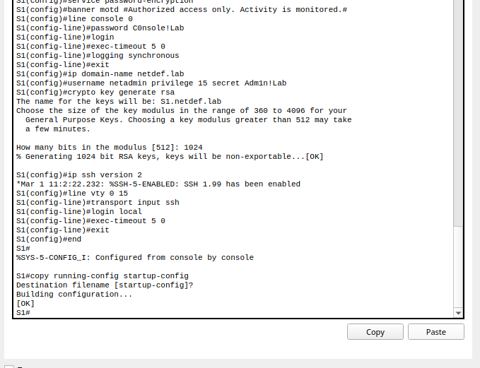 | 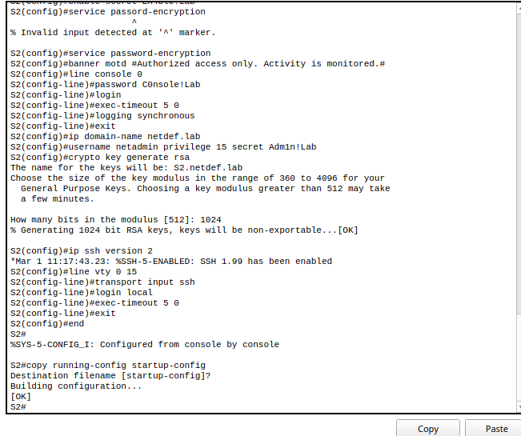 |

### Ext-Srv

**Desktop → IP Configuration:** IP `198.51.100.10`, máscara `255.255.255.0`, gateway `198.51.100.1`. Em **Services → HTTP**, o serviço fica ligado.

---

## 6. Verificação

### Senhas protegidas na configuração

O `show running-config` mostra `service password-encryption`, `security passwords min-length 10` e a enable secret salva como hash (`enable secret 5 $1$...`). Nenhuma senha aparece em texto puro.

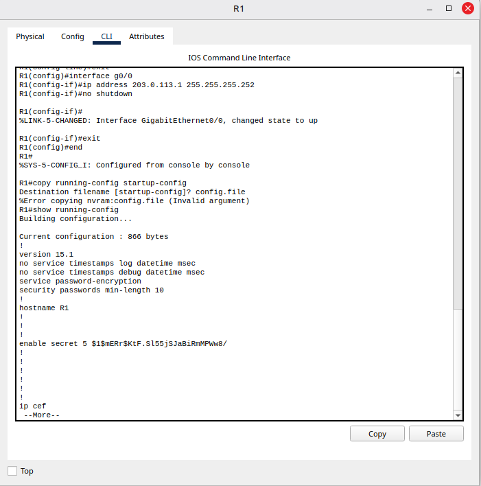

### Console protegido

Ao errar a senha do console três vezes, o roteador encerra a tentativa com `% Bad passwords`.

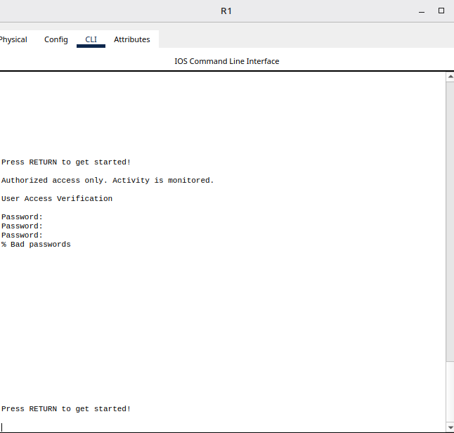

### Conectividade

| Teste | Resultado |
| --- | --- |
| R1 → ISP (`ping 203.0.113.2`) | ✅ 80% (o primeiro pacote se perde enquanto o ARP resolve o MAC) |
| ISP → Ext-Srv (`ping 198.51.100.10`) | ✅ 80% (mesmo motivo) |
| R1 → Ext-Srv, antes da rota padrão | ❌ 0% |
| R1 → Ext-Srv, depois da rota padrão | ✅ |

| R1 → ISP | ISP → Ext-Srv |
| --- | --- |
| 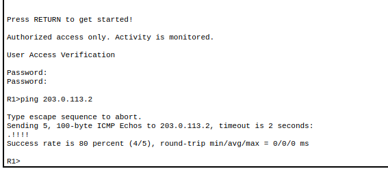 | 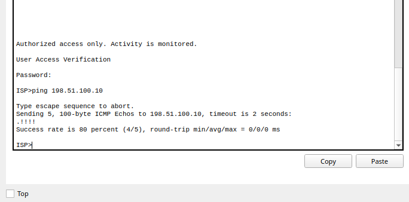 |

### Telnet recusado, SSH aceito

Teste feito a partir do roteador ISP:

| Comando | Resultado | Significado |
| --- | --- | --- |
| `telnet 203.0.113.1` | `Connection ... closed by foreign host` | ✅ R1 recusou o Telnet |
| `ssh -l netadmin 203.0.113.1` | Banner e prompt `R1#` | ✅ Login por SSH funcionou |

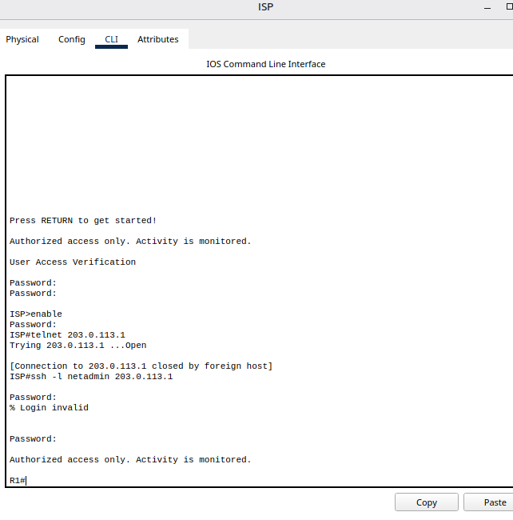

A primeira tentativa de SSH falhou (`% Login invalid`) por senha digitada errada. A segunda funcionou.

---

## 7. Problemas encontrados e soluções

### 7.1 Configuração não salva

**Sintoma:** `%Error copying nvram:config.file (Invalid argument)` ao salvar.
**Causa:** no prompt `Destination filename [startup-config]?`, foi digitado um nome de arquivo.
**Solução:** apenas pressionar **Enter** para aceitar o padrão entre colchetes. O resultado é `[OK]`.

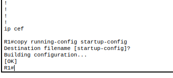

### 7.2 R1 não alcançava o Ext-Srv

**Sintoma:** `ping 198.51.100.10` em R1 com 0% de sucesso, enquanto o ISP alcançava o servidor.
**Causa:** R1 não tinha rota para a rede `198.51.100.0/24`. A tabela de rotas só tinha a rede conectada `203.0.113.0/30`.
**Solução:** rota padrão `ip route 0.0.0.0 0.0.0.0 203.0.113.2`.

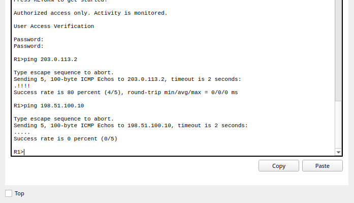

### 7.3 Comando não suportado no switch

**Sintoma:** `% Invalid input detected at '^' marker` em `security passwords min-length 10` no S1.
**Causa:** o 2960 do Packet Tracer não tem esse comando.
**Solução:** pular o comando no switch. Para descobrir o que o equipamento aceita, usar `?` (ex.: `security ?`).

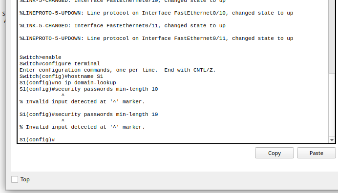

### 7.4 Senha de um caractere aceita

**Sintoma:** `enable secret E` foi aceito no S1 por um Enter pressionado cedo demais.
**Causa:** sem `min-length`, o switch aceita qualquer senha.
**Solução:** o comando seguinte, com a senha correta, substituiu o anterior.

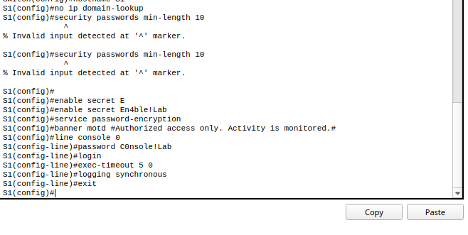

### 7.5 Comando de configuração no modo errado

**Sintoma:** `% Invalid input` em `ip domain-name netdef.lab`.
**Causa:** o prompt era `R1>` (modo usuário), e o comando só existe no modo de configuração.
**Solução:** `enable` → `configure terminal` → repetir o comando.

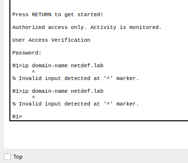

### 7.6 Senha do usuário recusada por ser curta

**Sintoma:** `% Password too short - must be at least 10 characters. Password not configured.`
**Causa:** a senha planejada para o usuário `netadmin` tinha só 9 caracteres, e a regra `min-length 10` de R1 a recusou.
**Solução:** usar uma senha com 10 caracteres ou mais. A mesma senha deve ser usada também em S1 e S2, para manter o padrão.

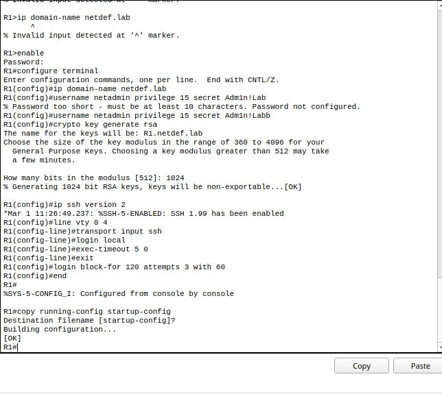

---

## 8. Limitações

- O switch 2960 no Packet Tracer **não suporta** `security passwords min-length`. Nos switches, a força das senhas depende só de quem as define.
- `service password-encryption` usa o **tipo 7**, que é facilmente reversível. Ele só impede a leitura casual da tela. Por isso, a senha de enable usa `enable secret` (hash).
- A enable secret usa **tipo 5 (MD5)**. Equipamentos reais mais novos suportam tipos mais fortes (8 = PBKDF2, 9 = scrypt), que não estão disponíveis nesta versão do Packet Tracer.
- O SSH dos switches ainda não pode ser testado, porque eles só recebem IP de gerenciamento no Lab 2.

---

## 9. Lições 

- **O `^` aponta onde o IOS parou de entender o comando.** Junto com o `?`, ele resolve a maioria dos erros de sintaxe.
- **Cada equipamento suporta comandos diferentes.** Um comando que funciona no roteador pode não existir no switch.
- **O último comando substitui o anterior.** Isso permite corrigir uma senha digitada errado sem apagar nada.
- **Regras de segurança também pegam erros de quem configura.** O `min-length` recusou uma senha fraca do próprio plano do lab.
- **Roteador só alcança redes que conhece.** Sem rota, o pacote é descartado.

---

## 10. Próximo passo

**Lab 2: VLANs, trunks e roteamento entre VLANs.** Separar usuários, servidores e gerência em VLANs diferentes, configurar as subinterfaces de R1 (*router-on-a-stick*), DHCP e NAT, e testar o SSH dos switches a partir do Admin-PC.
